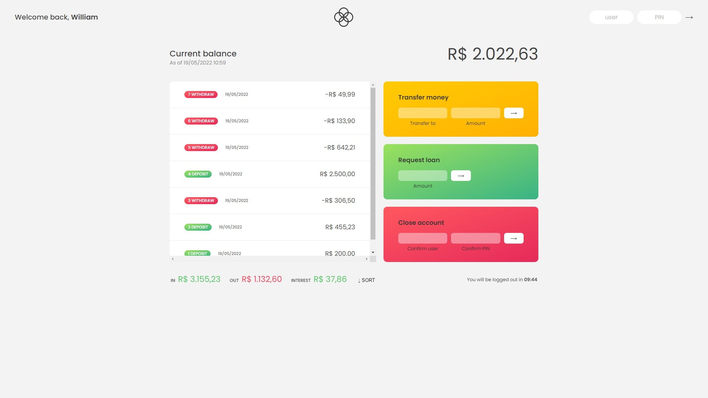
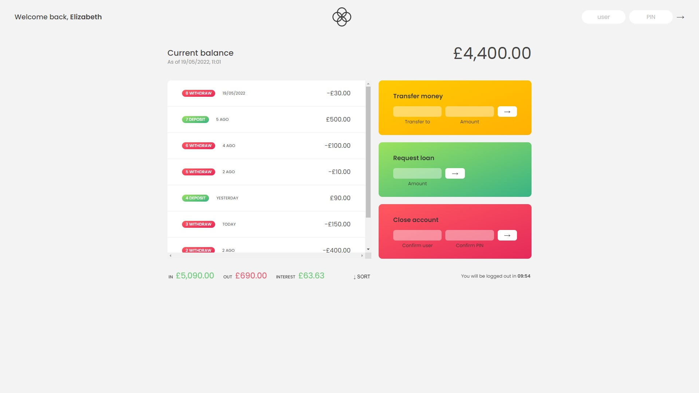

# Bankist

A minimalist banking application, built with **TypeScript** and **JQuery**, developed during my enroll on the Jonas Schmedtmann [JavaScript course](https://www.udemy.com/course/the-complete-javascript-course/ 'Course page on Udemy').

## About

This project consists of a fake banking application developed to learn and practice JavaScript programming topics like array methods, dates manipulation, internalization and timers. It includes features like tranfers, loan requests, a logout timer and more. Also, as a plus, I

-   refactored the project to structure the data using OOP;
-   applied webpack as module bundler;
-   Used TypeScript to add type safety;
-   Used JQuery in the UI to facilitate the DOM manipulation.

## Requirements

-   Nodejs `v16.14.0`;
-   NPM `v8.3.1`.

## Run locally

In order torun this project locally, run the following commands:

-   Clone this repository with `git clone https://github.com/William-Fernandes252/Pig-Game.git`;
-   Install the dependencies with `npm install`;
-   And whenever you want to build the project, run `npm run build`;
-   Also, you can try login with one of the accounts defined in the data module with it's username and pin (like 'wf' and '1111', for example).

## Snapshot

<h3 align="center">North american UI</h3>

<h3 align="center">England UI</h3>

